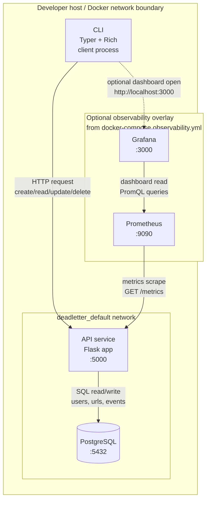

# Architecture

This diagram shows the runtime topology for the API, Postgres, optional observability stack, and CLI interactions.

## Port and network notes

- CLI to API: `localhost:5000` (request/response path).
- API to Postgres: `postgres:5432` on the compose network.
- Prometheus to API: scrape `http://api:5000/metrics`.
- Grafana UI: `localhost:3000`, reading data from Prometheus at `prometheus:9090`.
- Prometheus UI: `localhost:9090`.
